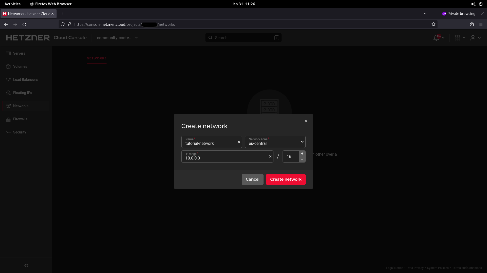
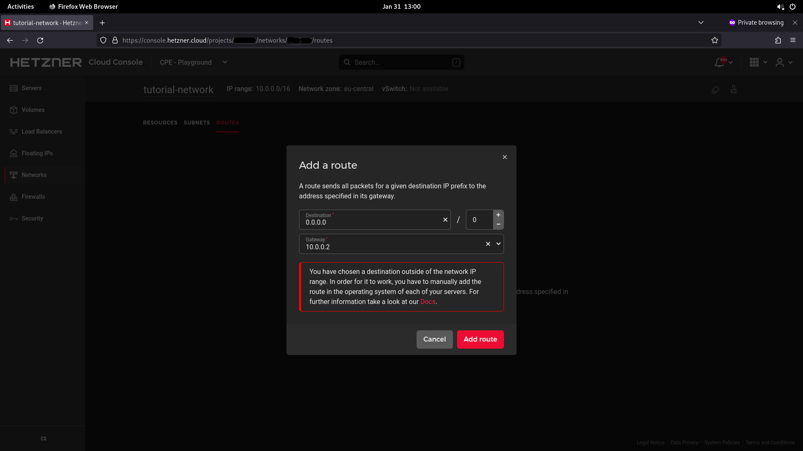

```yaml
SPDX-License-Identifier: MIT
path: "/templates/how-to-set-up-nat-gateway-for-cloud-private-networks"
slug: "how-to-setup-nat-gateway-for-cloud-private-networks"
date: "2023-01-31"
title: "So richten Sie ein NAT-Gateway für private Cloud-Netzwerke ein"
short_description: "In diesem Tutorial wird gezeigt, wie man ein NAT-Gateway für private Cloud-Netzwerke einrichtet und dabei nur verschiedene Linux-Distributionen verwendet."
tags: ["NAT", "Ubuntu"]
author: "Hetzner Online"
author_link: "https://github.com/hetzneronline"
author_img: "https://avatars.githubusercontent.com/u/30047064?s=200&v=4"
author_description: "-"
language: "de"
available_languages: ["en", "de"]
header_img: "header-x"
cta: "cloud"
```

## Einleitung

Dieses Tutorial zeigt, wie man ein generisches NAT-Gateway für Cloud Server über Cloud Private Networks einrichtet.

Wenn Sie speziell an der Verwendung von pfSense interessiert sind, haben wir ein eigenes Tutorial [hier](https://community.hetzner.com/tutorials/how-to-route-cloudserver-over-private-network-using-pfsense-and-hcnetworks#configure-route-for-private-networking).

Dieses Tutorial ist für `Ubuntu 18.04, 20.04 und 22.04`, `Debian 10 und 11`, `CentOS 7, Stream 8 und Stream 9`, `Fedora 36 und 37` und `Rocky Linux 8 und 9` geschrieben.

**Voraussetzungen**

- Hetzner Cloud Konto

## Schritt 1 - Einrichtung des Netzwerks und der Server

Der erste Schritt besteht darin, ein Netzwerk zu erstellen. Dies kann durchgeführt werden unter:

`Networks > Create network`.

Das Netzwerk kann auch später bei der Bestellung der Server erstellt werden.



Hier muss das Netzwerk ausgewählt werden.

Alternativ können Sie die Server auch in Ihrer Netzwerkübersicht zuordnen.


Es werden mindestens zwei Server benötigt.
Der NAT-Server muss eine IPv4-Adresse haben, der Andere nicht.

## Step 2 - Add route to network

Damit unsere Einrichtung richtig funktioniert, müssen wir die folgende Route zum Netzwerk hinzufügen:



Das Gateway sollte die IP des Servers sein, auf dem wir Masquerading konfiguriert haben.

## Step 3 - Configuring NAT

Um NAT zu konfigurieren, werden wir die folgenden Befehle verwenden:

```
echo 1 > /proc/sys/net/ipv4/ip_forward
```

Zur Aktivierung der IP-Weiterleitung, da diese standardmäßig deaktiviert ist.

```
iptables -t nat -A POSTROUTING -s '10.0.0.0/16' -o eth0 -j MASQUERADE
```

Schauen wir uns den Befehl im Detail an:

- iptables -> das Programm, das wir verwenden

- -t nat -> die Tabelle 'nat' auswählen

- -A POSTROUTING -> eine Regel zum Postrouting hinzufügen

- -s '10.0.0.0/16' -> Zielpakete von der Quelle '10.0.0.0/16'

- -o eth0 -> Ausgabe an 'eth0'

- -j MASQUERADE -> die Pakete mit der IP-Adresse des "Routers" maskieren

Um die Clients zu konfigurieren, müssen wir nur eine Standardroute hinzufügen. Zum Beispiel so:

```
ip route add default via 10.0.0.1
```

### Schritt 3a - /network/interfaces # ifupdown

***Funktioniert mit Debian 10, Debian 11, Ubuntu 18.04, Ubuntu 22.04***

Zunächst muss das System aktualisiert werden:

```
apt update && apt upgrade -y
```

---

***Ubuntu 22.04 erfordert zusätzlich:***

```
apt install ifupdown
```

---

Dieses Tutorial zeigt die Schritte unter Verwendung von `vim`, das mit `apt install` installiert werden kann: `apt install vim`

#### Schritt 3a.1 - NAT-Host

Um alles beständig zu machen, öffnen wir die folgende Datei:

```
vim /etc/network/interfaces
```

Um den Bearbeitungsmodus in `vim` aufzurufen, drücken Sie `i` und fügen Sie folgendes an die Datei an:

```
auto eth0
iface eth0 inet dhcp
    post-up echo 1 > /proc/sys/net/ipv4/ip_forward
    post-up   iptables -t nat -A POSTROUTING -s '10.0.0.0/16' -o eth0 -j MASQUERADE
```

Um die Datei zu speichern, drücken Sie `esc`, um den Einfügemodus zu verlassen und geben Sie `:x` oder `:wq` ein.

#### Schritt 3a.2 - andere Hosts

Da die Route auch persistent sein soll, bearbeiten wir die folgende Datei:

```
vim /etc/network/interfaces
```

Und fügen hinzu:

```
auto ens10
iface ens10 inet dhcp
    post-up ip route add default via 10.0.0.1
```

### Schritt 3b - netplan # networkd-dispatcher

***Funktioniert mit Ubuntu 20.04***

Zunächst muss das System aktualisiert werden:

```
apt update && apt upgrade -y
```

Ubuntu 20.04 verwendet standardmäßig `netplan` anstelle von `/etc/interfaces`. Um eine dauerhafte Konfiguration zu erreichen, wird der [networkd-dispatcher](https://gitlab.com/craftyguy/networkd-dispatcher) verwendet.

Wie im [netplan FAQ](https://netplan.io/faq) zu lesen ist, besteht das `networkd-dispatcher`-Äquivalent zu `post-up` darin, ein Skript in `/etc/networkd-dispatcher/routable.d/` abzulegen. In diesem Tutorium nennen wir das Skript `50-masq`, aber der Name ist nicht wichtig:

#### Schritt 3b.1 - NAT-Host

Erstellen Sie die Datei:

```
vim /etc/networkd-dispatcher/routable.d/50-masq
```

Und fügen Sie hinzu:

```
#!/bin/sh

/bin/echo 1 > /proc/sys/net/ipv4/ip_forward
/sbin/iptables -t nat -A POSTROUTING -s '10.0.0.0/16' -o eth0 -j MASQUERADE
```

Der folgende Befehl ist erforderlich, um das Skript ausführbar zu machen, andernfalls wird es nicht funktionieren:

```
chmod +x /etc/networkd-dispatcher/routable.d/50-masq
```

#### Schritt 3b.2 - andere Hosts

Erstellen Sie die Datei:

```
vim /etc/networkd-dispatcher/routable.d/50-masq
```

Und fügen Sie hinzu:

```
#!/bin/sh

/sbin/ip route add default via 10.0.0.1
```

Zum Schluss machen Sie es ausführbar:

```
chmod +x /etc/networkd-dispatcher/routable.d/50-masq
```

### Schritt 3c - NetworkManager # dispacher.d

***Funktioniert mit CentOS 7, CentOS Stream 8, CentOS Stream 9, Rocky Linux 8, Rocky Linux 8, Fedora 36, Fedora 37***

Zunächst muss das System aktualisiert werden:

```
yum update -y && yum upgrade -y 
```

Wir verwenden die `dispatcher.d` des `NetworkManager`, um unsere Skripte automatisch beim Start auszuführen. Dies geschieht, indem wir das Skript in den Ordner `/etc/NetworkManager/dispatcher.d/` legen. Dabei bestimmt der Name die Ausführungsbedingung des Skripts. Weitere Informationen finden Sie [hier](https://man.archlinux.org/man/NetworkManager-dispatcher.8.en).

In diesem Tutorial verwenden wir den Namen `ifup-local`, wobei `ifup` die Bedingung ist, unter der das Skript ausgeführt werden soll.

#### Schritt 3c.1 - NAT-Host

---

***Fedora 36, Fedora 37 benötigen zusätzlich:***

```
yum install iptables -y
```

---

Erstellen Sie die Datei:

```
vi /etc/NetworkManager/dispatcher.d/ifup-local
```

Und fügen Sie hinzu:

```
#!/bin/sh

/bin/echo 1 > /proc/sys/net/ipv4/ip_forward
/sbin/iptables -t nat -A POSTROUTING -s '10.0.0.0/16' -o eth0 -j MASQUERADE
```

Zum Schluss machen Sie es ausführbar:

```
chmod +x /etc/NetworkManager/dispatcher.d/ifup-local
```

#### Schritt 3c.2 - other Hosts

---

***CentOS Stream 8, CentOS Stream 9, Rocky Linux 8, Rocky Linux 9, Fedora 36, Fedora 37 benötigen zusätzlich:***

```
yum remove hc-utils -y
```

Dies gilt auch für andere Methoden zum Hinzufügen einer Route zum Betriebssystem.

---

Erstellen Sie die Datei:

```
vi /etc/NetworkManager/dispatcher.d/ifup-local
```

Und fügen Sie hinzu:

```
#!/bin/sh

/sbin/ip route add default via 10.0.0.1
```

Zum Schluss machen Sie es ausführbar:

```
chmod +x /etc/NetworkManager/dispatcher.d/ifup-local
```

## Fazit

Wenn Sie alle diese Schritte befolgt haben, haben Sie Ihr System erfolgreich so konfiguriert, dass es sich in Ihrem privaten Cloud-Netzwerk wie ein NAT-Router verhält. 
